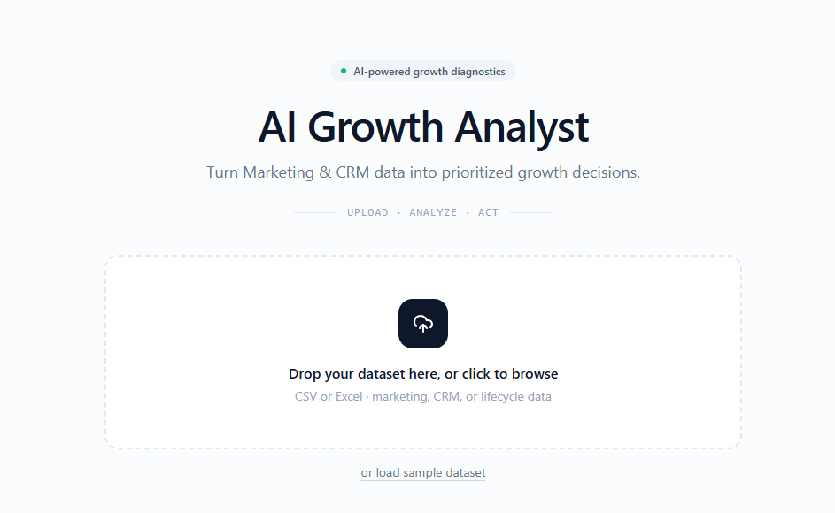
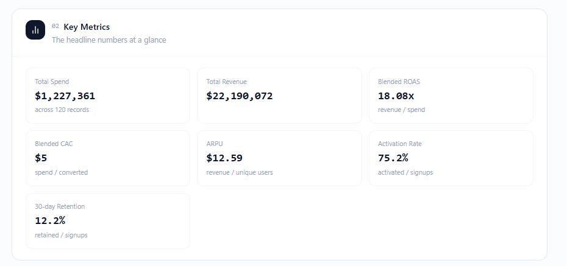
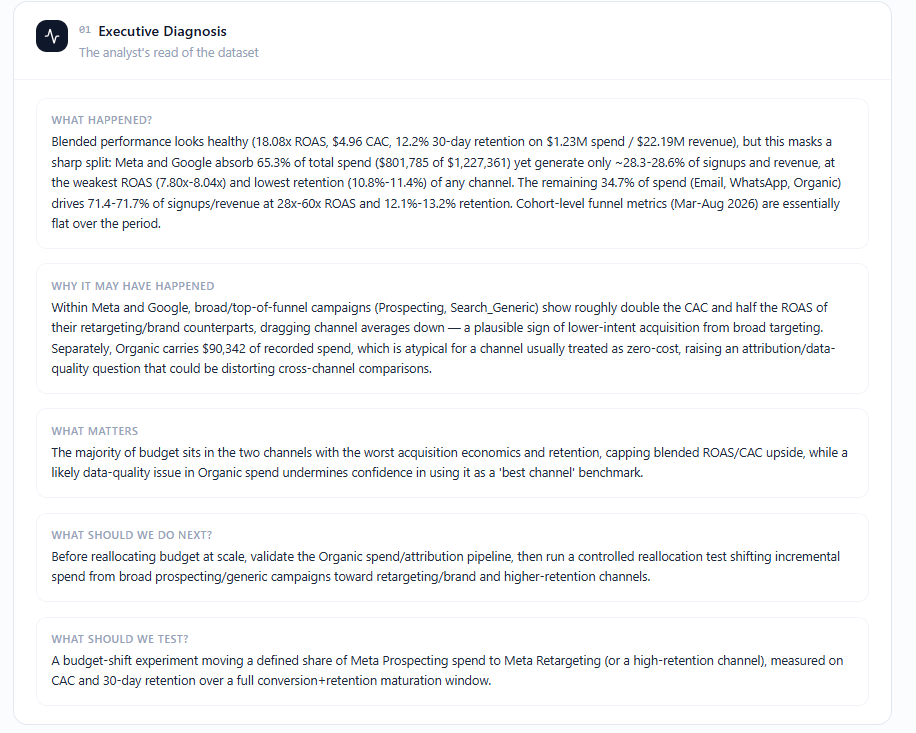
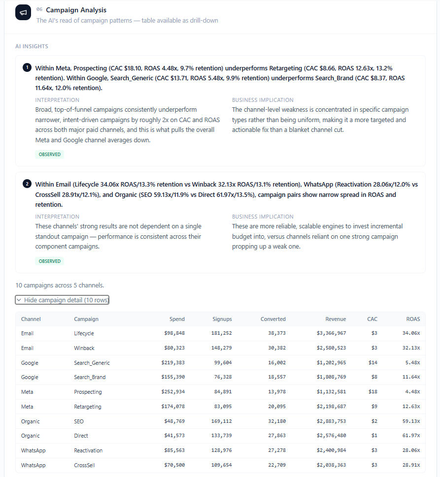
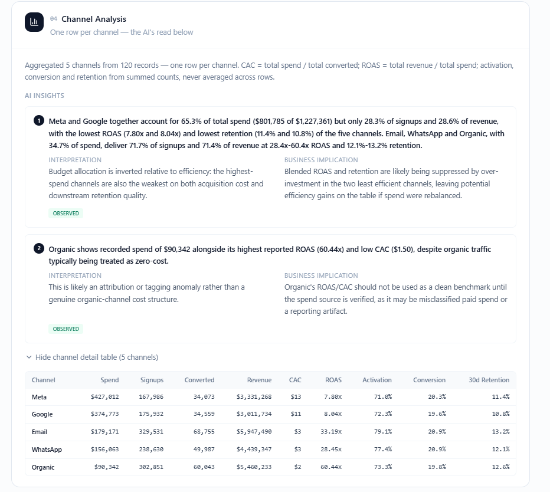
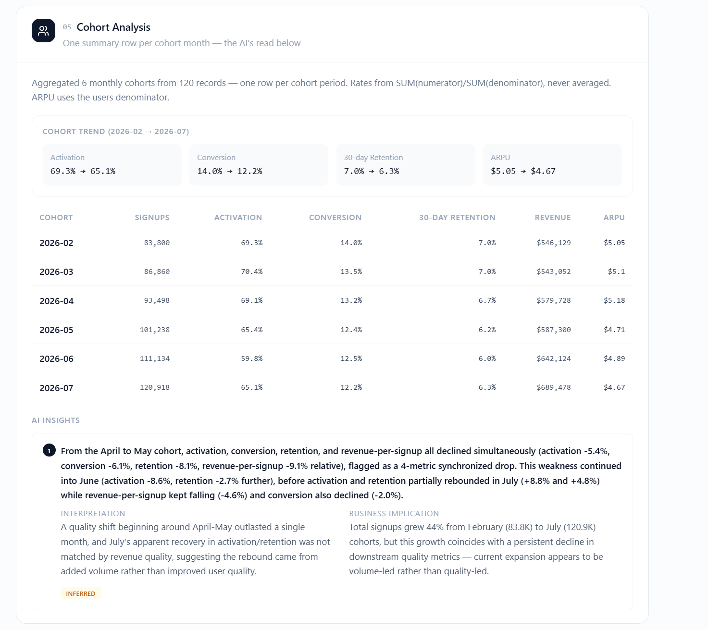
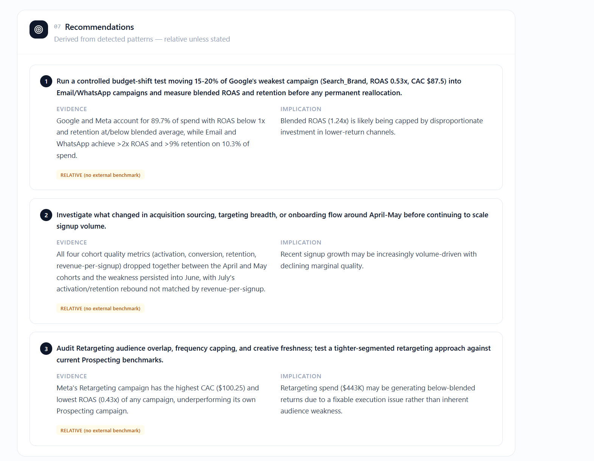

# The Auto-Analyst

> **Design an AI that interprets data, surfaces patterns, and writes its own insights.**

The Auto-Analyst is an AI-powered growth analytics application designed to turn raw growth and campaign data into structured analysis, meaningful patterns, growth diagnoses, recommendations, and testable experiments.

The system combines deterministic analytics with LLM-based reasoning so that calculations remain data-driven while the AI focuses on interpreting what the numbers mean.

## Overview

Growth teams often have access to large amounts of campaign, channel, cohort, and funnel data, but identifying the most important patterns still requires significant manual analysis.

The Auto-Analyst is designed to automate this analytical workflow.

Instead of simply reporting the highest or lowest metrics, the system looks for relationships across multiple dimensions and identifies patterns that are potentially meaningful from a growth perspective.

## What It Does

The application analyzes:

- Acquisition
- Activation
- Conversion
- Retention
- Monetization
- Channel performance
- Campaign performance
- Cohort performance

It goes beyond simply ranking metrics and attempts to identify relationships and patterns that are meaningful from a growth perspective.

## How It Works

```text
Dataset
    ↓
Data Validation & Normalisation
    ↓
Metric Calculations
    ↓
Pattern Detection
    ↓
Structured Analysis
    ↓
AI Reasoning
    ↓
Growth Diagnosis
    ↓
Recommendations
    ↓
Growth Experiment
```

## Product Preview

### 1. Data Input

The application accepts growth and campaign datasets and prepares the data for analysis.



### 2. Growth Analysis

The application calculates and presents the core growth metrics and overall performance.



### 3. Growth Diagnosis

The AI interprets the analytical results and identifies the most material growth signals and constraints.



### 4. Campaign Analysis

Campaign-level analysis helps identify meaningful performance patterns and campaigns that materially explain channel results.



### 5. Channel Analysis

Channel performance is evaluated across spend, revenue, efficiency, activation, conversion, and retention.



### 6. Cohort Analysis

Cohort analysis evaluates changes in user quality and performance over time.



### 7. AI Recommendations

The system turns detected patterns into specific growth actions and a testable experiment.



## Analytical Framework

The analysis follows:

```text
Acquisition → Activation → Conversion → Retention → Monetization
```

### Acquisition

Evaluates traffic, impressions, clicks, spend, CTR and CPC.

### Activation

Evaluates signup and activation behaviour.

### Conversion

Evaluates conversion performance and CAC.

### Retention

Evaluates cohort retention and D30 performance.

### Monetization

Evaluates revenue, AOV, ARPU and ROAS.

## Metrics

| Metric | Calculation |
|---|---|
| CTR | Clicks / Impressions |
| CPC | Spend / Clicks |
| Visitor-to-Signup Rate | Signups / Visitors |
| Activation Rate | Activated Users / Signups |
| Conversion Rate | Converted Users / Signups |
| CAC | Spend / Converted Users |
| CPA | Spend / Signups |
| AOV | Revenue / Orders |
| ARPU | Revenue / Users |
| Revenue per Signup | Revenue / Signups |
| D30 Retention | D30 Retained Users / Signups |
| ROAS | Revenue / Spend |

Aggregated metrics use summed numerators and denominators rather than averaging row-level percentages.

## Pattern Detection

The system does not generate an insight simply because a metric is the highest, lowest, or has changed.

It looks for:

- Inflection points
- Persistent changes
- Outliers
- Relationships between metrics
- Funnel contradictions
- Cross-channel patterns
- Campaign-level patterns
- Cohort-level patterns
- Scale versus quality differences

The objective is to surface the strongest patterns rather than produce a long list of metric observations.

## AI Reasoning

The AI receives structured analytical results and is instructed to:

1. Identify the three most material growth signals
2. Support observations with actual numbers
3. Explain commercial significance
4. Separate observed facts from inferred drivers
5. Identify the most important funnel constraint
6. Compare channels, campaigns and cohorts
7. Recommend specific growth actions
8. Propose one testable growth experiment
9. Define primary and secondary KPIs
10. State confidence and limitations

The reasoning layer is designed not to invent metrics, benchmarks, or causal explanations unsupported by the dataset.

## Channel Analysis

Channel performance is evaluated across multiple dimensions including:

- Spend
- Revenue
- ROAS
- CAC
- Activation
- Conversion
- Retention

This allows the system to distinguish between patterns such as:

```text
Efficient + High Quality
Efficient + Weak Downstream Quality
Inefficient + High Quality
Inefficient + Weak Downstream Quality
```

## Campaign Analysis

Campaign analysis helps explain what is driving channel-level performance.

Rather than reporting every campaign ranking, the system surfaces campaigns that reveal a meaningful pattern or materially explain a channel result.

## Cohort Analysis

Cohort analysis evaluates how user quality changes over time.

The system can compare:

- Activation
- Conversion
- Revenue
- Retention
- Cohort performance

Repeated or similar cohort movements are consolidated so that the AI focuses on the underlying pattern.

## Recommendations & Experiments

Recommendations are derived from detected patterns rather than simple metric rankings.

Each recommendation is intended to answer:

> What should be tested or changed next, and why?

The system can generate a structured growth experiment containing:

- Hypothesis
- Recommended action
- Primary KPI
- Secondary KPI
- Measurement considerations

When the data does not establish causality, the explanation is treated as a hypothesis rather than a fact.

## Data Validation

The application validates and normalises incoming datasets before analysis.

It supports common variations such as:

```text
users
unique_users
signups
registrations
activated
activated_users
converted
converted_users
orders
revenue
revenue_usd
d30_retained_users
```

The system also flags potential data-quality issues that could affect interpretation.

## Technology

### Frontend

- React
- JavaScript
- Vite
- Tailwind CSS

### Application Platform

- Base44

### AI

- Claude Sonnet 5
- Server-side LLM integration

### Analytics

- Deterministic metric engine
- Pattern detection
- Channel analysis
- Campaign analysis
- Cohort analysis
- AI-generated growth diagnosis

## Testing

The application has been tested using synthetic datasets with intentionally different performance patterns.

Testing covered:

- Metric calculation accuracy
- Aggregated calculations
- Field-name variations
- Channel analysis
- Campaign analysis
- Cohort analysis
- Pattern detection
- AI interpretation
- Recommendations
- Experiment generation
- Data-quality handling

Different datasets were used to verify that the resulting analysis changes according to the underlying data rather than following a fixed narrative.

## Project Structure

```text
the-auto-analyst/
│
├── base44/
│   ├── config.json
│   ├── entities/
│   └── functions/
│
├── docs/
│   └── screenshots/
│       ├── 01-input.png
│       ├── 02-growth-analysis.png
│       ├── 03-growth-diagnosis.png
│       ├── 04-campaign-analysis.png
│       ├── 05-channel-analysis.png
│       ├── 06-cohort-analysis.png
│       └── 07-ai-recommendations.png
│
├── src/
│   ├── api/
│   ├── components/
│   ├── pages/
│   └── ...
│
├── AI_Growth_Analyst_Master_Prompt.txt
├── AGENTS.md
├── CLAUDE.md
├── package.json
├── package-lock.json
├── vite.config.js
├── tailwind.config.js
└── README.md
```

## Run Locally

Clone the repository:

```bash
git clone <your-repository-url>
```

Navigate to the project:

```bash
cd the-auto-analyst
```

Install dependencies:

```bash
npm install
```

Start the development server:

```bash
npm run dev
```

The application will then be available at the local development URL shown by Vite.

## Live Application

**The Auto-Analyst**

https://growth-logic-labs-app.base44.app

## Data & Privacy

The project uses synthetic datasets for testing and demonstration.

No confidential customer or production datasets are required for the examples included with the project.

API keys, secrets, and environment variables should never be committed to the repository.

## Project Objective

The goal of The Auto-Analyst is to explore how AI can move beyond reporting metrics and help interpret growth data.

> **Data tells you what happened. The Auto-Analyst is designed to help identify what matters, explain why it may matter, and determine what to test next.**

## Author

**Mahatab Khan**

Growth & Marketing professional focused on CRM, lifecycle marketing, growth analytics, experimentation, and AI-assisted marketing workflows.
